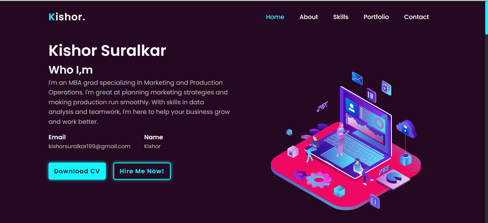
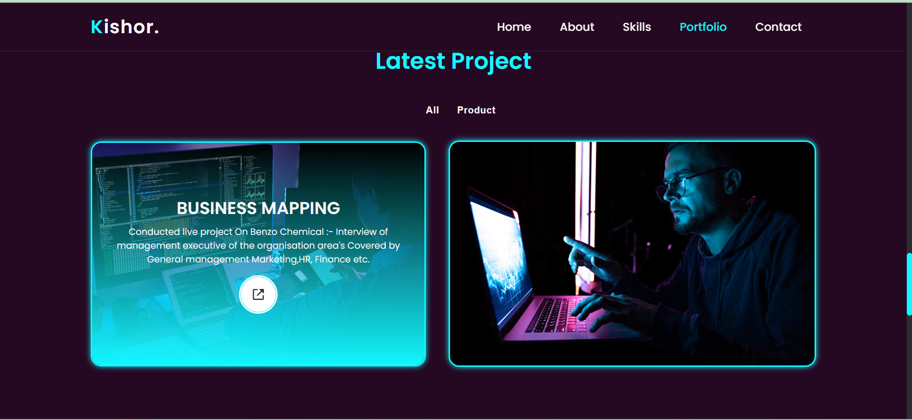

# Portfolio Website

Welcome to my portfolio website! This site showcases my projects, skills, and experiences. It's built using HTML, CSS, and JavaScript.

## Table of Contents

- [Introduction](#introduction)
- [Features](#features)
- [Technologies Used](#technologies-used)
- [Installation](#installation)
- [Usage](#usage)
- [Screenshots](#screenshots)
- [Contact](#contact)
- [License](#license)

## Introduction

This portfolio website is a personal project aimed at demonstrating my web development skills. It includes various sections such as an about me page, a projects gallery, a skills showcase, and a contact form.

## Features

- **Responsive Design:** The website is fully responsive and works on all device sizes.
- **Interactive Elements:** Utilizes JavaScript for interactive components like sliders, modals, and forms.
- **Smooth Scrolling:** Enhanced user experience with smooth scrolling between sections.
- **Project Gallery:** Displays my projects with descriptions and links to live demos and source code.
- **Contact Form:** Users can reach out to me directly through the contact form.

## Technologies Used

- **HTML:** For structuring the content.
- **CSS:** For styling the website and making it responsive.
- **JavaScript:** For adding interactivity and dynamic behavior.

## Installation

To run this project locally, follow these steps:

1. **Clone the repository:**

    ```bash
    git clone https://github.com/rjghongade/kishorsuralkarportfolio.git
    ```

2. **Navigate to the project directory:**

    ```bash
    cd kishorsuralkarportfolio
    ```

3. **Open `index.html` in your browser:**

    Simply open the `index.html` file in your preferred web browser to view the website.

## Usage

Explore the different sections of the website to learn more about me and my work. You can navigate using the menu or by scrolling through the page. Check out my projects, read about my skills, and feel free to use the contact form to get in touch.

## Screenshots


*Description of the home page screenshot.*


*Description of the projects section screenshot.*

## Contact

If you have any questions or would like to collaborate, feel free to reach out to me:

- **Email:** rajughongade9022@gmail.com
- **LinkedIn:** [Your LinkedIn Profile](https://www.linkedin.com/in/rajendra-ghongade-07b337259/)
- **GitHub:** [Your GitHub Profile](https://github.com/rjghongade)

[screen-capture (1).webm](https://github.com/rjghongade/kishorsuralkarportfolio/assets/105046011/c04988a9-e93b-4f8e-a53d-12a3bdd7f035)

## License

This project is licensed under the MIT License. See the [LICENSE](LICENSE) file for more details.
